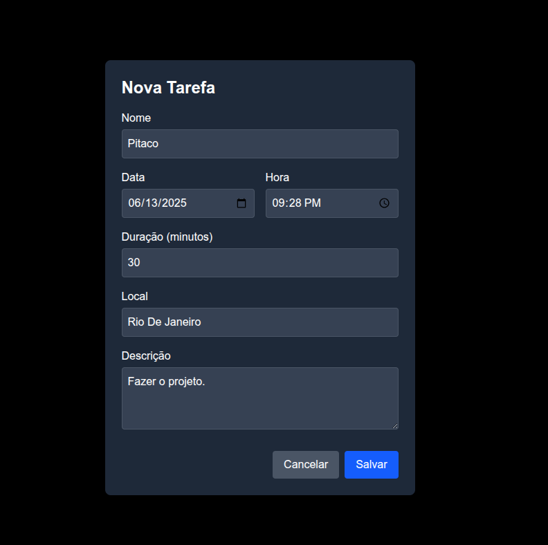

# Projeto Rei Do Pitaco - Product Engineer

<div style="text-align: center;">
  
</div>

Este é um projeto que envolve um backend em Node.js com Express e PostgreSQL e um frontend em Next.js com React e FullCalendar.

## Como Rodar o Projeto


### Rodar com o Docker - Mais Simples

```bash
sudo docker-compose up --build
```
```bash
Com isso seus ambientes estão em:
Front-End: http://localhost:3000/
Back-End: http://localhost:8000/
```

### Instruções para rodar sem Docker - Mais Complicado.
Siga estas instruções para configurar e executar o projeto localmente.

### Pré-requisitos

Certifique-se de ter o seguinte instalado:

*   Node.js (versão LTS recomendada)
*   npm (gerenciador de pacotes do Node.js)
*   PostgreSQL (servidor de banco de dados)

### Configuração do Banco de Dados

1.  Crie um banco de dados PostgreSQL chamado `appointments_db`:
    ```bash
    createdb appointments_db
    ```

2.  Crie um arquivo `.env` na pasta `backend/` com as suas credenciais do PostgreSQL e a porta do servidor (exemplo):
    ```env
    PORT=8000
    NODE_ENV=development

    # Database Configuration
    DB_USER=seu_usuario
    DB_HOST=localhost
    DB_NAME=appointments_db
    DB_PASSWORD=sua_senha
    DB_PORT=5432
    ```

3.  Execute o script de inicialização do banco de dados para criar a tabela `appointments`:
    ```bash
    cd backend
    psql -d appointments_db -f src/database/schema.sql
    ```

### Configuração e Execução do Backend

1.  Navegue até a pasta `backend/` no terminal:
    ```bash
    cd backend
    ```

2.  Instale as dependências do backend:
    ```bash
    npm install
    ```

3.  Inicie o servidor backend (em modo de desenvolvimento):
    ```bash
    npm run dev
    ```
    O servidor estará rodando em `http://localhost:8000` (ou na porta especificada no seu `.env`).

### Configuração e Execução do Frontend

1.  Navegue até a pasta `frontend/` no terminal:
    ```bash
    cd ../frontend
    ```

2.  Instale as dependências do frontend:
    ```bash
    npm install
    ```

3.  Crie um arquivo `.env` na raiz da pasta `frontend/` com a URL do backend:
    ```env
    NEXT_PUBLIC_API_URL=http://localhost:8000
    ```

4.  Inicie a aplicação frontend:
    ```bash
    npm run dev
    ```
    A aplicação estará rodando em `http://localhost:3000`.

## Screenshots/Vídeos

### Front-End:
<div style="text-align: center;">
<h3>1. Criando tarefa</h3>

<h3>2. DashBoard com as tarefas atuais</h3>

<h3>3. Calendário</h3>

<h3>4. Deletar tarefa</h3>

<h3>5. Após Deletar tarefa</h3>

<h3>6. Após o DragAndDrop</h3>

</div>

### Back-End:

<div style="text-align: center;">
<h3>1. Get </h3>

<h3>2. Post </h3>

<h3>3. Delete </h3>

<h3>4. Patch </h3>


</div>

## Decisões Técnicas e Arquitetura

Este projeto foi estruturado com uma arquitetura simples de frontend e backend (`mono-repo` básico), utilizando as seguintes tecnologias e bibliotecas:

*   **Backend:**
    *   Node.js: Ambiente de execução JavaScript.
    *   Express: Framework web minimalista e flexível para Node.js.
    *   pg: Cliente PostgreSQL para Node.js, utilizado para interagir com o banco de dados.
    *   dotenv: Carrega variáveis de ambiente de um arquivo `.env`.
    *   cors: Middleware para habilitar Cross-Origin Resource Sharing.
    *   nodemon: Monitora alterações no código e reinicia o servidor automaticamente (para desenvolvimento).
    *   uuid: Gera UUIDs para IDs dos agendamentos.
    *   Estrutura simples de rotas para CRUD (Create, Read, Delete) de agendamentos.
    *   Script de inicialização do banco de dados (`src/database/init.js`) para criar a tabela automaticamente ao iniciar o backend, garantindo a configuração em novos ambientes.

*   **Frontend:**
    *   Next.js: Framework React com renderização do lado do servidor (embora o componente principal use 'use client').
    *   React: Biblioteca para construir interfaces de usuário.
    *   FullCalendar (`@fullcalendar/react`, `@fullcalendar/daygrid`, `@fullcalendar/core`): Componente de calendário interativo para exibir os agendamentos.
    *   axios: Cliente HTTP para fazer requisições à API backend.
    *   Tailwind CSS: Framework CSS utilitário para estilização rápida.
    *   `react-beautiful-dnd`: Biblioteca para funcionalidades de arrastar e soltar (DragAndDrop) na tela Scrum.
    *   Gerenciamento de estado local com `useState` e efeitos colaterais com `useEffect`.
    *   Middleware simples (`src/middleware/axios.ts`) para configurar o Axios com a URL base da API.

## Uso de Inteligência Artificial
A IA foi utilizada para:

*   **Geração de código inicial (Kick Off):** Ajudou a criar a estrutura básica do backend com Express e a conectar com o PostgreSQL.
*   **Estruturação de ideias:** Ajudou a planejar os passos para implementar funcionalidades (ex: conexão com BD, exibição no calendário).
*   **Documentação:** Auxiliou na criação e formatação deste arquivo README, garantindo que todas as informações relevantes fossem incluídas de forma clara.
*   **Criatividade** Ajudou na estilização do Front-End.
*   **Produtividade** A utilização da IA acelerou o processo de desenvolvimento.

## Processo Criativo e de Desenvolvimento

O desenvolvimento seguiu uma abordagem iterativa

* Primeiro defini os requisitos minimos, tendo em vista que é um MVP.
* Além deles, começou-se a pensar em features que ajudariam a experiencia do usuário.
* A idéia inicial que era de apenas um app de organização pessoal, foi adaptada para um contexto de Scrum, pois se isso fosse tranformado em produto, essa ideia ajudaria para um target mais direcionado ao publico que utiliza Agile em seu cotidiano (Devs,PMs,SM,...)
* Depois começou-se a implementar o Front-End, com os dados mockados.
* Após o Front-End funcionar com os dados mockados, partiu-se para a implementação do Back-End.
* Depois de todas as rotas do Backe-End funcionando, juntou-se as duas soluções.
* Documentar.
* Docker e Deploy.

## Oque faria diferente se tivesse mais tempo e se esse projeto não fosse concepcionado como MVP
* CI/CD.
* Tests.
* Refatoração da UI.